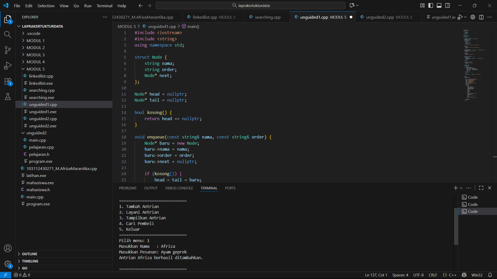
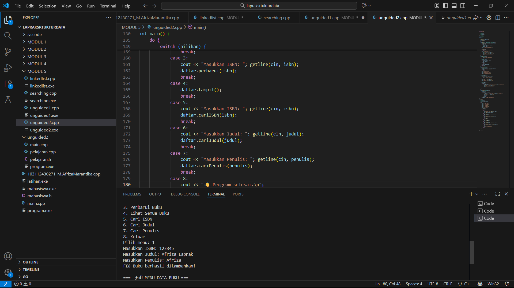

# M.AFRIZA-MARANTIKA-103112430271-MODUL-5
LAPRAK MODUL 5

# <h1 align="center">Laporan Praktikum Modul 5 <br> SINGLY LINKED LIST (BAGIAN KEDUA) </h1>
<p align="center">M.AFRIZA MARANTIKA - 103112430271</p>

## Dasar Teori

Singly Linked List adalah struktur data yang terdiri dari beberapa node yang saling terhubung lewat pointer. Setiap node punya dua bagian: data dan pointer ke node berikutnya. Berbeda dari array, ukurannya fleksibel sehingga mudah menambah atau menghapus data.Pencarian data dilakukan dengan menelusuri node satu per satu, sedangkan penambahan dan penghapusan cukup dengan mengatur pointer. Kelebihannya fleksibel dan efisien, tapi kekurangannya akses harus berurutan dan butuh memori ekstra untuk pointer. Struktur ini juga jadi dasar dari bentuk linked list lain seperti doubly dan circular linked list.
## Guided
### soal 1 (linkedlist.cpp)
```c++
#include <iostream>
using namespace std;

struct Node {
    int nilai;
    Node* next;
};

Node* head = nullptr;

// Buat node baru
Node* buatNode(int angka) {
    Node* baru = new Node();
    baru->nilai = angka;
    baru->next = nullptr;
    return baru;
}

// Tambah data di depan
void tambahDepan(int angka) {
    Node* baru = buatNode(angka);
    baru->next = head;
    head = baru;
    cout << "Data " << angka << " ditambahkan di depan.\n";
}

// Tambah data di belakang
void tambahBelakang(int angka) {
    Node* baru = buatNode(angka);
    if (head == nullptr) {
        head = baru;
    } else {
        Node* bantu = head;
        while (bantu->next != nullptr) {
            bantu = bantu->next;
        }
        bantu->next = baru;
    }
    cout << "Data " << angka << " ditambahkan di belakang.\n";
}

// Tambah data setelah target
void sisipSetelah(int target, int angkaBaru) {
    Node* bantu = head;
    while (bantu != nullptr && bantu->nilai != target) {
        bantu = bantu->next;
    }

    if (bantu == nullptr) {
        cout << "Data " << target << " tidak ditemukan!\n";
    } else {
        Node* baru = buatNode(angkaBaru);
        baru->next = bantu->next;
        bantu->next = baru;
        cout << "Data " << angkaBaru << " disisipkan setelah " << target << ".\n";
    }
}

// Hapus data tertentu
void hapusData(int angka) {
    if (head == nullptr) {
        cout << "List kosong!\n";
        return;
    }

    Node* hapus = head;
    Node* prev = nullptr;

    if (hapus != nullptr && hapus->nilai == angka) {
        head = hapus->next;
        delete hapus;
        cout << "Data " << angka << " dihapus.\n";
        return;
    }

    while (hapus != nullptr && hapus->nilai != angka) {
        prev = hapus;
        hapus = hapus->next;
    }

    if (hapus == nullptr) {
        cout << "Data " << angka << " tidak ditemukan!\n";
    } else {
        prev->next = hapus->next;
        delete hapus;
        cout << "Data " << angka << " dihapus.\n";
    }
}

// Update data
void ubahData(int lama, int baru) {
    Node* bantu = head;
    while (bantu != nullptr && bantu->nilai != lama) {
        bantu = bantu->next;
    }

    if (bantu == nullptr) {
        cout << "Data " << lama << " tidak ditemukan!\n";
    } else {
        bantu->nilai = baru;
        cout << "Data " << lama << " berhasil diubah menjadi " << baru << ".\n";
    }
}

// Tampilkan isi list
void tampilList() {
    if (head == nullptr) {
        cout << "List kosong!\n";
        return;
    }
    Node* bantu = head;
    cout << "Isi Linked List: ";
    while (bantu != nullptr) {
        cout << bantu->nilai << " -> ";
        bantu = bantu->next;
    }
    cout << "NULL\n";
}

// Program utama
int main() {
    int pilih, angka, target, baru;

    do {
        cout << "\n=== MENU LINKED LIST ===\n";
        cout << "1. Tambah Depan\n";
        cout << "2. Tambah Belakang\n";
        cout << "3. Sisip Setelah\n";
        cout << "4. Hapus Data\n";
        cout << "5. Ubah Data\n";
        cout << "6. Tampilkan List\n";
        cout << "0. Keluar\n";
        cout << "Pilih: ";
        cin >> pilih;

        switch (pilih) {
            case 1:
                cout << "Masukkan angka: ";
                cin >> angka;
                tambahDepan(angka);
                break;
            case 2:
                cout << "Masukkan angka: ";
                cin >> angka;
                tambahBelakang(angka);
                break;
            case 3:
                cout << "Masukkan data target: ";
                cin >> target;
                cout << "Masukkan data baru: ";
                cin >> baru;
                sisipSetelah(target, baru);
                break;
            case 4:
                cout << "Masukkan angka yang ingin dihapus: ";
                cin >> angka;
                hapusData(angka);
                break;
            case 5:
                cout << "Masukkan data lama: ";
                cin >> angka;
                cout << "Masukkan data baru: ";
                cin >> baru;
                ubahData(angka, baru);
                break;
            case 6:
                tampilList();
                break;
            case 0:
                cout << "Program selesai.\n";
                break;
            default:
                cout << "Pilihan tidak valid!\n";
        }

    } while (pilih != 0);

    return 0;
}

```
Program ini membuat Singly Linked List dengan node berisi data dan pointer. head sebagai awal list. Ada fungsi untuk tambah, sisip, hapus, ubah, dan tampilkan data. Semua operasi dilakukan dengan mengatur pointer antar node. Program pakai menu agar pengguna bisa pilih operasi.


> Output
### soal 2 (searching.cpp)
```c++
#include <iostream>
using namespace std;

#define NIL nullptr

// Struktur Node
struct Node {
    int data;
    Node* next;

    Node(int value) {
        data = value;
        next = NIL;
    }
};

// Kelas Linked List
class LinkedList {
private:
    Node* head;

public:
    // Konstruktor
    LinkedList() {
        head = NIL;
    }

    // Cek list kosong
    bool empty() {
        return head == NIL;
    }

    // Tambah depan
    void addFront(int value) {
        Node* baru = new Node(value);
        baru->next = head;
        head = baru;
    }

    // Tambah belakang
    void addBack(int value) {
        Node* baru = new Node(value);
        if (empty()) {
            head = baru;
        } else {
            Node* tail = head;
            while (tail->next != NIL) tail = tail->next;
            tail->next = baru;
        }
    }

    // Tambah setelah node tertentu
    void addAfter(Node* prev, int value) {
        if (prev != NIL) {
            Node* baru = new Node(value);
            baru->next = prev->next;
            prev->next = baru;
        }
    }

    // Hapus depan
    void removeFront() {
        if (!empty()) {
            Node* temp = head;
            head = head->next;
            delete temp;
        }
    }

    // Hapus belakang
    void removeBack() {
        if (!empty()) {
            if (head->next == NIL) {
                delete head;
                head = NIL;
            } else {
                Node* prev = NIL;
                Node* curr = head;
                while (curr->next != NIL) {
                    prev = curr;
                    curr = curr->next;
                }
                prev->next = NIL;
                delete curr;
            }
        }
    }

    // Hapus setelah node tertentu
    void removeAfter(Node* prev) {
        if (prev != NIL && prev->next != NIL) {
            Node* temp = prev->next;
            prev->next = temp->next;
            delete temp;
        }
    }

    // Hapus node dengan nilai tertentu
    void removeValue(int value) {
        if (empty()) return;
        Node* curr = head;
        Node* prev = NIL;

        while (curr != NIL && curr->data != value) {
            prev = curr;
            curr = curr->next;
        }

        if (curr != NIL) {
            if (prev == NIL) head = curr->next;
            else prev->next = curr->next;
            delete curr;
        }
    }

    // Hitung jumlah node
    int count() {
        int n = 0;
        Node* ptr = head;
        while (ptr != NIL) {
            n++;
            ptr = ptr->next;
        }
        return n;
    }

    // Tampilkan isi list
    void show() {
        if (empty()) {
            cout << "List kosong\n";
            return;
        }
        Node* ptr = head;
        cout << "Isi List: ";
        while (ptr != NIL) {
            cout << ptr->data << " ";
            ptr = ptr->next;
        }
        cout << endl;
    }

    // Cari node berdasarkan nilai
    Node* find(int value) {
        Node* ptr = head;
        while (ptr != NIL) {
            if (ptr->data == value) return ptr;
            ptr = ptr->next;
        }
        return NIL;
    }

    // Balik urutan list
    void reverse() {
        Node* prev = NIL;
        Node* curr = head;
        Node* next = NIL;
        while (curr != NIL) {
            next = curr->next;
            curr->next = prev;
            prev = curr;
            curr = next;
        }
        head = prev;
    }

    // Hapus semua elemen
    void clear() {
        Node* ptr = head;
        while (ptr != NIL) {
            Node* temp = ptr;
            ptr = ptr->next;
            delete temp;
        }
        head = NIL;
    }

    // Salin isi list ke list lain
    void copyTo(LinkedList &dest) {
        dest.clear();
        Node* ptr = head;
        while (ptr != NIL) {
            dest.addBack(ptr->data);
            ptr = ptr->next;
        }
    }

    // Destruktor
    ~LinkedList() {
        clear();
    }
};

// Main program
int main() {
    LinkedList L;

    cout << "=== Program Linked List C++ (Versi Beda) ===\n";

    L.addFront(10);
    L.addFront(5);
    L.addBack(15);
    L.addBack(20);

    L.show();
    cout << "Jumlah elemen: " << L.count() << endl;

    cout << "Hapus depan...\n";
    L.removeFront();
    L.show();

    cout << "Hapus belakang...\n";
    L.removeBack();
    L.show();

    cout << "Cari nilai 10...\n";
    Node* found = L.find(10);
    if (found) cout << "Ditemukan: " << found->data << endl;
    else cout << "Tidak ditemukan\n";

    cout << "Balik urutan list...\n";
    L.reverse();
    L.show();

    cout << "Hapus semua elemen...\n";
    L.clear();
    L.show();

    return 0;
}
```
Program ini membuat singly linked list dengan class. Setiap node menyimpan data dan alamat node berikutnya. Pointer head menandai awal list. Program memiliki fungsi untuk menambah data di depan atau belakang, menyisipkan setelah node tertentu, menghapus node di depan, belakang, atau sesuai nilai, mencari data, menghitung jumlah elemen, menampilkan isi list, membalik urutan list, dan menghapus semua data. Semua operasi dilakukan dengan mengatur pointer antar node. Program utama hanya mendemonstrasikan cara kerja fungsi-fungsi tersebut.

> Output

## Unguided

### Soal 1

```c++
#include <iostream>
#include <string>
using namespace std;

struct Node {
    string nama;
    string order;
    Node* next;
};

Node* head = nullptr;
Node* tail = nullptr;

bool kosong() {
    return head == nullptr;
}

void enqueue(const string& nama, const string& order) {
    Node* baru = new Node;
    baru->nama = nama;
    baru->order = order;
    baru->next = nullptr;

    if (kosong()) {
        head = tail = baru;
    } else {
        tail->next = baru;
        tail = baru;
    }
    cout << "Antrian " << nama << " berhasil ditambahkan.\n";
}

void dequeue() {
    if (kosong()) {
        cout << "Antrian kosong, tidak ada yang dilayani.\n";
        return;
    }

    Node* hapus = head;
    cout << "Melayani pembeli: " << hapus->nama << " - " << hapus->order << endl;
    head = head->next;
    if (head == nullptr) tail = nullptr;
    delete hapus;
}

void tampil() {
    if (kosong()) {
        cout << "Tidak ada antrian.\n";
        return;
    }

    cout << "\n=== Daftar Antrian ===\n";
    Node* temp = head;
    int nomor = 1;
    while (temp != nullptr) {
        cout << nomor << ". " << temp->nama << " - " << temp->order << endl;
        temp = temp->next;
        nomor++;
    }
    cout << endl;
}

void cari(const string& namaCari) {
    if (kosong()) {
        cout << "Antrian kosong.\n";
        return;
    }

    Node* temp = head;
    int posisi = 1;
    bool ketemu = false;

    while (temp != nullptr) {
        if (temp->nama == namaCari) {
            cout << "\nPembeli ditemukan!\n";
            cout << "Posisi : " << posisi << endl;
            cout << "Nama   : " << temp->nama << endl;
            cout << "Pesanan: " << temp->order << endl;
            ketemu = true;
            break;
        }
        temp = temp->next;
        posisi++;
    }

    if (!ketemu) {
        cout << "Pembeli \"" << namaCari << "\" tidak ditemukan.\n";
    }
}

int main() {
    int menu;
    string nama, pesanan;

    do {
        cout << "=============================\n";
        cout << "   SISTEM ANTRIAN PEMBELI    \n";
        cout << "=============================\n";
        cout << "1. Tambah Antrian\n";
        cout << "2. Layani Antrian\n";
        cout << "3. Tampilkan Antrian\n";
        cout << "4. Cari Pembeli\n";
        cout << "5. Keluar\n";
        cout << "=============================\n";
        cout << "Pilih menu: ";
        cin >> menu;
        cin.ignore();

        switch (menu) {
            case 1:
                cout << "Masukkan Nama   : ";
                getline(cin, nama);
                cout << "Masukkan Pesanan: ";
                getline(cin, pesanan);
                enqueue(nama, pesanan);
                break;
            case 2:
                dequeue();
                break;
            case 3:
                tampil();
                break;
            case 4:
                cout << "Nama pembeli yang dicari: ";
                getline(cin, nama);
                cari(nama);
                break;
            case 5:
                cout << "Program selesai.\n";
                break;
            default:
                cout << "Pilihan tidak valid!\n";
        }

        cout << endl;
    } while (menu != 5);

    return 0;
}
```
Program ini membuat sistem antrian pembeli menggunakan linked list. Setiap node menyimpan nama dan pesanan. Variabel front dan rear menandai awal dan akhir antrian. Fungsi tambahAntrian menambah pembeli ke antrian, layaniAntrian menghapus pembeli dari depan, tampilAntrian menampilkan semua antrian, dan cariPembeli mencari nama tertentu dalam antrian. Program utama menampilkan menu pilihan dan menjalankan fungsi sesuai input pengguna.
       
> Output
> 


### Soal 2

```c++
#include <iostream>
#include <string>
using namespace std;

struct Buku {
    string isbn;
    string judul;
    string penulis;
    Buku* next;
};

class LinkedList {
private:
    Buku* head;

public:
    LinkedList() : head(nullptr) {}

    bool kosong() {
        return head == nullptr;
    }

    void tambah(string isbn, string judul, string penulis) {
        Buku* baru = new Buku{isbn, judul, penulis, nullptr};
        if (kosong()) {
            head = baru;
        } else {
            Buku* temp = head;
            while (temp->next) temp = temp->next;
            temp->next = baru;
        }
        cout << "✅ Buku berhasil ditambahkan!\n";
    }

    void tampil() {
        if (kosong()) {
            cout << "📭 Tidak ada data buku.\n";
            return;
        }
        cout << "\n📚 Daftar Buku:\n";
        for (Buku* t = head; t; t = t->next) {
            cout << "ISBN    : " << t->isbn << "\n";
            cout << "Judul   : " << t->judul << "\n";
            cout << "Penulis : " << t->penulis << "\n";
            cout << "-------------------------\n";
        }
    }

    void hapus(string isbn) {
        if (kosong()) {
            cout << "⚠️ Daftar buku kosong.\n";
            return;
        }
        Buku* temp = head;
        Buku* prev = nullptr;
        while (temp && temp->isbn != isbn) {
            prev = temp;
            temp = temp->next;
        }
        if (!temp) {
            cout << "❌ Buku tidak ditemukan.\n";
            return;
        }
        if (!prev) head = head->next;
        else prev->next = temp->next;
        delete temp;
        cout << "🗑️ Buku berhasil dihapus!\n";
    }

    void perbarui(string isbn) {
        Buku* temp = head;
        while (temp && temp->isbn != isbn) temp = temp->next;
        if (!temp) {
            cout << "❌ Buku tidak ditemukan.\n";
            return;
        }
        cout << "Masukkan judul baru: ";
        getline(cin, temp->judul);
        cout << "Masukkan penulis baru: ";
        getline(cin, temp->penulis);
        cout << "✅ Data buku diperbarui!\n";
    }

    void cariISBN(string isbn) {
        Buku* t = head;
        while (t && t->isbn != isbn) t = t->next;
        if (!t) {
            cout << "❌ Buku tidak ditemukan.\n";
            return;
        }
        cout << "\n📗 Buku ditemukan:\n";
        cout << "ISBN    : " << t->isbn << "\n";
        cout << "Judul   : " << t->judul << "\n";
        cout << "Penulis : " << t->penulis << "\n";
    }

    void cariJudul(string judul) {
        Buku* t = head;
        bool ada = false;
        while (t) {
            if (t->judul == judul) {
                if (!ada) cout << "\n📕 Buku dengan judul \"" << judul << "\" ditemukan:\n";
                cout << "ISBN    : " << t->isbn << "\n";
                cout << "Penulis : " << t->penulis << "\n";
                cout << "-------------------------\n";
                ada = true;
            }
            t = t->next;
        }
        if (!ada) cout << "❌ Buku tidak ditemukan.\n";
    }

    void cariPenulis(string penulis) {
        Buku* t = head;
        bool ada = false;
        while (t) {
            if (t->penulis == penulis) {
                if (!ada) cout << "\n📘 Buku karya \"" << penulis << "\" ditemukan:\n";
                cout << "ISBN  : " << t->isbn << "\n";
                cout << "Judul : " << t->judul << "\n";
                cout << "-------------------------\n";
                ada = true;
            }
            t = t->next;
        }
        if (!ada) cout << "❌ Buku tidak ditemukan.\n";
    }
};

int main() {
    LinkedList daftar;
    int pilihan;
    string isbn, judul, penulis;

    do {
        cout << "\n=== 📚 MENU DATA BUKU ===\n";
        cout << "1. Tambah Buku\n";
        cout << "2. Hapus Buku\n";
        cout << "3. Perbarui Buku\n";
        cout << "4. Lihat Semua Buku\n";
        cout << "5. Cari ISBN\n";
        cout << "6. Cari Judul\n";
        cout << "7. Cari Penulis\n";
        cout << "8. Keluar\n";
        cout << "Pilih menu: ";
        cin >> pilihan;
        cin.ignore();

        switch (pilihan) {
            case 1:
                cout << "Masukkan ISBN: "; getline(cin, isbn);
                cout << "Masukkan Judul: "; getline(cin, judul);
                cout << "Masukkan Penulis: "; getline(cin, penulis);
                daftar.tambah(isbn, judul, penulis);
                break;
            case 2:
                cout << "Masukkan ISBN: "; getline(cin, isbn);
                daftar.hapus(isbn);
                break;
            case 3:
                cout << "Masukkan ISBN: "; getline(cin, isbn);
                daftar.perbarui(isbn);
                break;
            case 4:
                daftar.tampil();
                break;
            case 5:
                cout << "Masukkan ISBN: "; getline(cin, isbn);
                daftar.cariISBN(isbn);
                break;
            case 6:
                cout << "Masukkan Judul: "; getline(cin, judul);
                daftar.cariJudul(judul);
                break;
            case 7:
                cout << "Masukkan Penulis: "; getline(cin, penulis);
                daftar.cariPenulis(penulis);
                break;
            case 8:
                cout << "👋 Program selesai.\n";
                break;
            default:
                cout << "❌ Pilihan tidak valid!\n";
        }
    } while (pilihan != 8);

    return 0;
}

```
Program ini membuat sistem data buku dengan singly linked list. Setiap node menyimpan ISBN, judul, penulis, dan alamat buku berikutnya. Variabel head menandai awal data. Ada fungsi untuk menambah buku ke akhir list, menampilkan semua buku, menghapus buku berdasarkan ISBN, memperbarui data buku, serta mencari buku berdasarkan ISBN, judul, atau penulis. Program utama menggunakan menu agar pengguna dapat memilih operasi yang diinginkan.


> Output
> 


## Referensi

1. https://en.wikipedia.org/wiki/Data_structure
